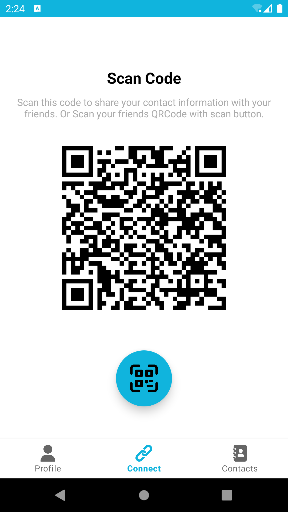
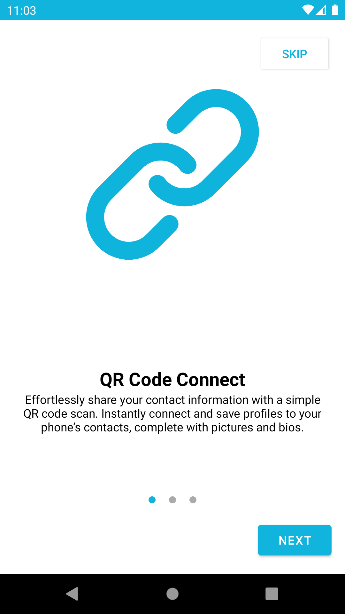
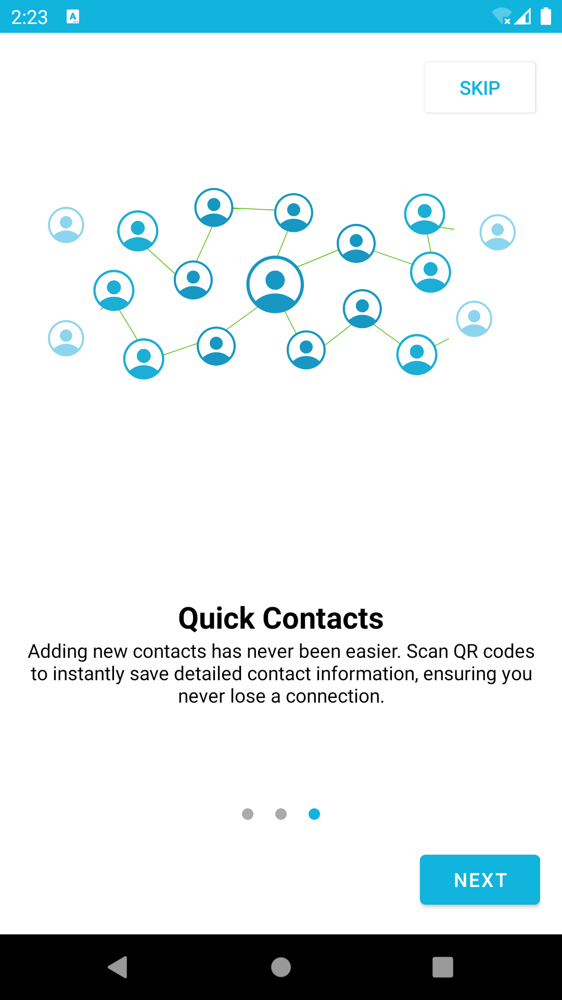
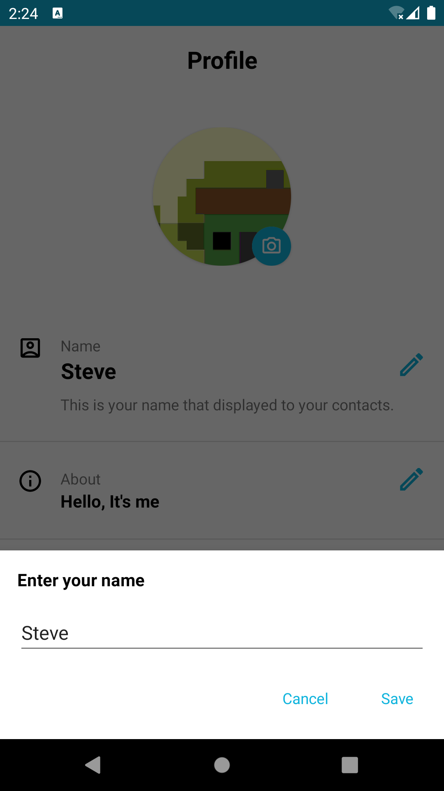
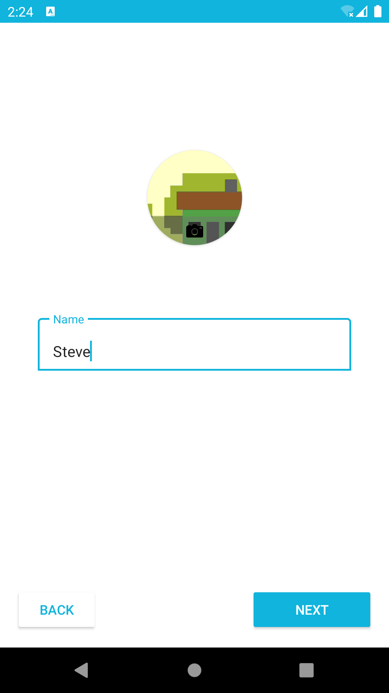

# Peyvand - QR Code Connect

Peyvand is a powerful app that allows you to share and receive contact information effortlessly using QR codes. Whether you're at a business meeting, social event, or just meeting someone new, Peyvand makes connecting easy.

## Features

### 1. QR Code Connect
Effortlessly share your contact information with a simple QR code scan. Instantly connect and save profiles to your phone’s contacts, complete with pictures and bios.

### 2. Connect with Ease
Simplify the way you connect with people. Use QR codes to quickly exchange contact details, including names, phone numbers, emails, and profile pictures. Perfect for business or social gatherings.

### 3. Quick Contacts
Adding new contacts has never been easier. Scan QR codes to instantly save detailed contact information, ensuring you never lose a connection.

## Screenshots

Here are some screenshots of the Peyvand app in action:

# My Android App

*Easy access to QR code.*

*Intro 1*

*Intro 2*

*Profile screen with a smooth UX*

*Register activity using ViewPager*

## Download

Download the latest version of Peyvand:

[Download Peyvand APK](https://github.com/HadiAgdam/Peyvand/releases/tag/v1.0.0)

## How to Use

1. **Download and Install**: Download the APK from the link above and install it on your Android device.
2. **Open the App**: Launch Peyvand on your phone.
3. **Generate a QR Code**: Enter your contact information and generate a QR code.
4. **Share**: Let others scan your QR code to instantly share your contact information.
5. **Scan and Save**: Scan others' QR codes to instantly save their contact details to your phone.

## Contributing

Contributions are welcome! Feel free to open an issue or submit a pull request.

## Contact

If you have any questions or need support, please reach out to us at hadiagdam0@gmail.com
